# INTRODUCTION

## PURPOSE

## REPOSITORY

# SYSTEM OVERVIEW

## ARCHITECTURE

### SIMPLIFIED FLOWCHART

**Note:** Refer to *flowchart.txt* file.

### SNAKE C CODE BREAKDOWN

**Note:** Given the development environment of this project, the *stdlib.h* library could not be included to generate the apple's random coordinates, thus, extra custom functions to generate random numbers were creating for the project:

- Processor directives:

```c
#define SNAKE_COLOR 0xff0000 // RED
#define APPLE_COLOR 0x00ff00 // GREEN
#define MAX_SNAKE_LENGTH 50 
#define PIXEL_SIZE 2
#define GAME_SPEED 3000 
#define SNAKE_START_X 10
#define SNAKE_START_Y 10
```

- Custom data types:

```c
typedef enum {GAME_OVER, PLAYING} Status;

typedef enum {UP, DOWN, LEFT, RIGHT} Keys;

typedef enum {FALSE, TRUE} Boolean;

typedef struct {unsigned x, y;} Apple;

typedef struct {unsigned x, y; Keys direction;} SnakeSegment;

typedef struct {SnakeSegment segments[MAX_SNAKE_LENGTH]; int length; Apple apple;} Snake;
```

- Necessary variables for the code to interact with hardware and to generate random numbers:

```c
unsigned *led_base = (unsigned*) LED_MATRIX_0_BASE;
unsigned *switch_base = (unsigned*) SWITCHES_0_BASE;
unsigned *up = (unsigned*) D_PAD_0_UP;
unsigned *down = (unsigned*) D_PAD_0_DOWN;
unsigned *left = (unsigned*) D_PAD_0_LEFT;
unsigned *right = (unsigned*) D_PAD_0_RIGHT;
unsigned seed = 12345; // SEED USED TO GENERATE RANDOM NUMBERS
```

- Program functions:

```c
unsigned rand_ripes(); // CUSTOM RAND FUNCTION
unsigned rand_mod(unsigned max); // PART OF CUSTOM RAND FUNCTION
void create_snake(Snake *snake);
void clear_screen();
void delay();
void init_game(Snake *snake);
void init_apple_coordinates(Snake *snake, int seed);
void move_snake(Snake *snake);
Boolean wall_collision(Snake *snake);
Boolean snake_collision(Snake *snake);
Boolean snake_collision_with_apple(Snake *snake);
void change_head_direction(Snake *snake);
void move_snake_head(Snake *snake);
```

- rand_ripes() function:

This function implements a custom random number generator based on a linear congruential generator (LCG) algorithm. It updates the global seed using a specific formula and returns the new value. The modulo operation ensures the value stays within the bounds of a 32-bit signed integer. This random function is deterministic, meaning the same seed always produces the same sequence.

- rand_mod() function:

This function utilizes rand_ripes() to generate a pseudo-random number in the range [0, max - 1]. It simply takes the output of rand_ripes() and computes the remainder when divided by max, effectively constraining the result to the desired range.

- create_snake() function:

This function initializes a Snake object to its starting state. It sets the snake's initial length to 1, places its head at the coordinates (SNAKE_START_X, SNAKE_START_Y), and sets its initial direction to RIGHT. The apple's coordinates are reset to (0, 0), indicating that it needs to be placed later in the game.

```c
void create_snake(Snake *snake) {
    snake->length = 1;
    snake->segments[0].x = SNAKE_START_X;
    snake->segments[0].y = SNAKE_START_Y;
    snake->segments[0].direction = RIGHT;
    snake->apple.x = 0;
    snake->apple.y = 0;
}
```

- clear_screen() function:

This function clears the LED matrix screen by iterating through all pixels and setting their color value to 0x000000 (black). It ensures the screen is reset at the start of each game frame. The nested loops handle the LED matrix's dimensions and pixel size to achieve this.

```c
void clear_screen() {
    for (int y = PIXEL_SIZE; y < LED_MATRIX_0_HEIGHT; ++y) {
        for (int x = PIXEL_SIZE; x < LED_MATRIX_0_WIDTH; ++x) 
            *(led_base + y * LED_MATRIX_0_WIDTH + x) = 0x000000;
    }

    for (int i = 0; i < LED_MATRIX_0_WIDTH; ++i) {
        for (int j = 0; j < PIXEL_SIZE; ++j) 
            *(led_base + j * LED_MATRIX_0_WIDTH + i) = 0x000000;   
    }
}
```

- delay() function:

This function introduces a delay by running an empty loop a number of times determined by the GAME_SPEED constant. The volatile keyword prevents the compiler from optimizing away the loop. This is used to control the game's speed by pausing execution between frames.

```c
void delay() {
    volatile unsigned delay_var = 0;
    for (int i = 0; i < GAME_SPEED; ++i, ++delay_var);
}
```

- init_game() function:

This function draws the snake and apple on the LED matrix. It iterates through the snake's segments, setting the corresponding pixels to the snake's color (SNAKE_COLOR). If an apple is present, it sets the apple's position on the screen to the color APPLE_COLOR. This visually represents the game state.

```c
void init_game(Snake *snake) {
    for (int i = 0; i < snake->length; ++i) {
        for (int x = 0; x < PIXEL_SIZE; ++x) {
            for (int y = 0; y < PIXEL_SIZE; ++y) {
                if (!i) *(led_base + (snake->apple.y + y) * LED_MATRIX_0_WIDTH + (snake->apple.x + x)) = APPLE_COLOR;
                
                *(led_base + (snake->segments[i].y + y) * LED_MATRIX_0_WIDTH + (snake->segments[i].x + x)) = SNAKE_COLOR;
            }
        }
    }
}
```

- init_apple_coordinates() function:

This function calculates random coordinates for the apple within the LED matrix bounds using the rand_mod() function. It ensures the coordinates are aligned with the pixel grid and fall within valid ranges. The apple is then assigned these coordinates.

```c
void init_apple_coordinates(Snake *snake, int seed){
    int x = rand_mod(LED_MATRIX_0_WIDTH - PIXEL_SIZE);
    int y = rand_mod(LED_MATRIX_0_HEIGHT - PIXEL_SIZE);
    
    if (x % 2) 
        --x;
    if (y % 2) 
        --y;

    if (x < PIXEL_SIZE) 
        x = PIXEL_SIZE;
    if (y < PIXEL_SIZE) 
        y = PIXEL_SIZE;

    snake->apple.x = x;
    snake->apple.y = y;
}
```

- move_snake() function:

This function updates the position of the snake's body segments by shifting each segment to the position of the segment directly ahead of it. This effectively moves the snake forward while preserving its current direction.

```c
void move_snake(Snake *snake){
    for (int i = snake->length - 1; i > 0; --i) {
        snake->segments[i].x = snake->segments[i - 1].x;
        snake->segments[i].y = snake->segments[i - 1].y;
    }
}
```

- wall_collision() function:

This function checks if the snake's head has collided with the walls of the LED matrix. If the head's coordinates are outside the valid boundaries, it returns TRUE, indicating a collision; otherwise, it returns FALSE.

```c
Boolean wall_collision(Snake *snake){
    return (snake->segments[0].x < PIXEL_SIZE || 
           snake->segments[0].x >= LED_MATRIX_0_WIDTH - PIXEL_SIZE || 
           snake->segments[0].y < PIXEL_SIZE || 
           snake->segments[0].y >= LED_MATRIX_0_HEIGHT - PIXEL_SIZE) ? TRUE : FALSE;
}
```

- snake_collision() function:

This function detects whether the snake's head has collided with its own body. It compares the head's coordinates to those of each body segment. If a match is found, it returns TRUE, indicating a collision; otherwise, it returns FALSE.

```c
Boolean snake_collision(Snake *snake){
    for (int i = 1; i < snake->length; ++i) {
        if (snake->segments[0].x == snake->segments[i].x && snake->segments[0].y == snake->segments[i].y) 
            return TRUE;
    }
    return FALSE;
}
```

- snake_collision_with_apple() function:

This function checks if the snake's head is on the same coordinates as the apple. If the coordinates match, it returns TRUE, indicating the apple has been "eaten." Otherwise, it returns FALSE.

```c
Boolean snake_collision_with_apple(Snake *snake){
    return (snake->segments[0].x == snake->apple.x && snake->segments[0].y == snake->apple.y) ? TRUE : FALSE;
}
```

- change_head_direction() function:

This function updates the snake's head direction based on user input from the directional pad. It prevents the snake from reversing direction directly (e.g., moving UP when currently moving DOWN).

```c
void change_head_direction(Snake *snake){
    if (*up && snake->segments[0].direction != DOWN) 
        snake->segments[0].direction = UP;

    else if (*down && snake->segments[0].direction != UP) 
        snake->segments[0].direction = DOWN;

    else if (*left && snake->segments[0].direction != RIGHT) 
        snake->segments[0].direction = LEFT;

    else if (*right && snake->segments[0].direction != LEFT) 
        snake->segments[0].direction = RIGHT;
}
```

- move_snake_head() function:

This function moves the snake's head one step in its current direction. It adjusts the head's x or y coordinate based on whether the direction is UP, DOWN, LEFT, or RIGHT, maintaining the size of each step (PIXEL_SIZE).

```c
void move_snake_head(Snake *snake){
    if (snake->segments[0].direction == UP) 
        snake->segments[0].y -= PIXEL_SIZE;

    else if (snake->segments[0].direction == DOWN) 
        snake->segments[0].y += PIXEL_SIZE;

    else if (snake->segments[0].direction == LEFT) 
        snake->segments[0].x -= PIXEL_SIZE;

    else 
        snake->segments[0].x += PIXEL_SIZE;
}
```

- main function:

The `main()` function orchestrates the entire game, handling initialization, the game loop, and the restart logic.

1. **Initialization**:
   - A `Snake` object named `snake` is created to represent the game's snake.
   - The game's status is initialized to `PLAYING`, indicating the game is active.
   - `restart_flag` is used to track whether the game should be restarted.
   - `cnt` is initialized to zero to serve as a counter for random seed variation and other uses.

2. **Setup**:
   - `create_snake(&snake)` initializes the snake to its starting state (position, direction, and size).
   - `clear_screen()` ensures the LED matrix is cleared before the game starts.

3. **Game Loop**:
   - A nested `while (TRUE)` loop manages the game's execution, allowing for indefinite play.
   - Inside this loop, another loop (`while (gameStatus == PLAYING)`) handles the gameplay while the game is active.

4. **Gameplay**:
   - `clear_screen()` resets the screen at the beginning of each frame.
   - The game checks if the apple's coordinates are `(0, 0)` (unplaced). If so, it calls `init_apple_coordinates(&snake, cnt)` to generate a new position for the apple.
   - `init_game(&snake)` draws the current state of the snake and apple on the LED matrix.
   - `move_snake(&snake)` shifts the body of the snake forward.
   - `change_head_direction(&snake)` updates the snake's direction based on user input.
   - `move_snake_head(&snake)` moves the snake's head in the current direction.
   - `wall_collision(&snake)` and `snake_collision(&snake)` check if the snake hits a wall or itself, respectively. If either returns `TRUE`, `gameStatus` is set to `GAME_OVER`.
   - `snake_collision_with_apple(&snake)` checks if the snake has eaten the apple. If `TRUE`, the snake's length is incremented, and the apple's position is reset.

5. **Frame Delay**:
   - `delay()` introduces a pause between frames to control the speed of the game.
   - The counter `cnt` is incremented to track frame progress and vary the apple's position when needed.

6. **Game Over and Restart**:
   - After `gameStatus` is set to `GAME_OVER`, the outer loop checks if `restart_flag` is set. This flag is activated when the player toggles a specific switch (using `*(switch_base) & 0x01`).
   - If `restart_flag` is `TRUE`, the snake is re-initialized using `create_snake(&snake)`, and the game restarts by resetting `gameStatus` to `PLAYING`.


```c
void main(){
    Snake snake;
    Status gameStatus = PLAYING;
    Boolean restart_flag;
    unsigned cnt = 0;

    create_snake(&snake);
    clear_screen();
    while (TRUE) {
        while (gameStatus == PLAYING) {
            clear_screen();
            if (!(snake.apple.x && snake.apple.y)) init_apple_coordinates(&snake, cnt);

            init_game(&snake);
            move_snake(&snake);
            change_head_direction(&snake);
            move_snake_head(&snake);

            gameStatus = (wall_collision(&snake) || snake_collision(&snake)) ? GAME_OVER : PLAYING;

            if (snake_collision_with_apple(&snake)) {
                ++snake.length;
                snake.apple.x = 0;
                snake.apple.y = 0;
            }

            delay();
            ++cnt;
        }

        restart_flag = (*(switch_base) & 0x01 && gameStatus == GAME_OVER) ? TRUE : FALSE;
        
        if (restart_flag) {
            create_snake(&snake);
            gameStatus = PLAYING;
        }
    }
}
```

# CACHE TESTING

## MAPPING WITH 4 LINES

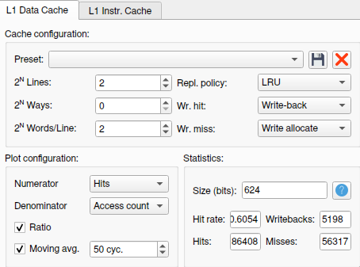

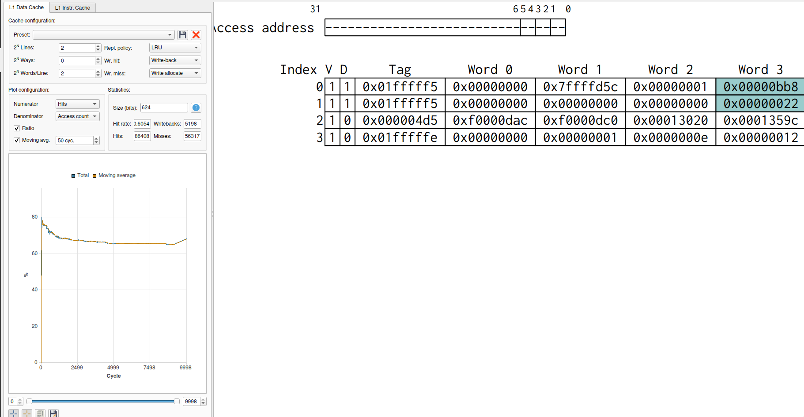

**HIT RATE:** 0.6054

## 2 LINES AND 2 WAYS

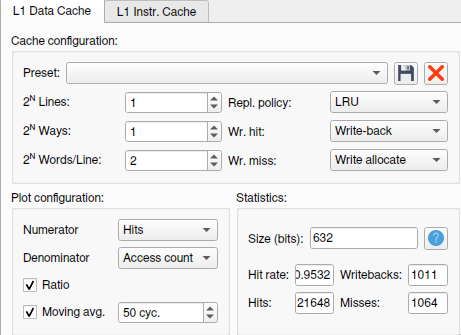

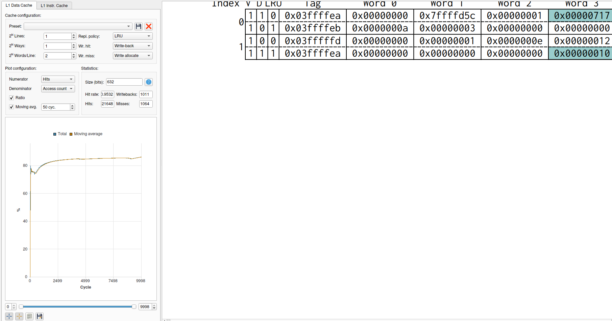

**HIT RATE:** 0.9532

## 4 WAYS

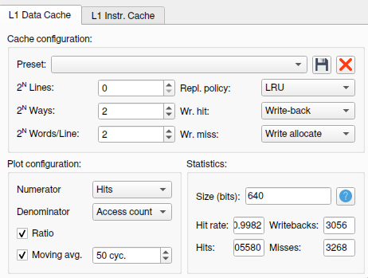

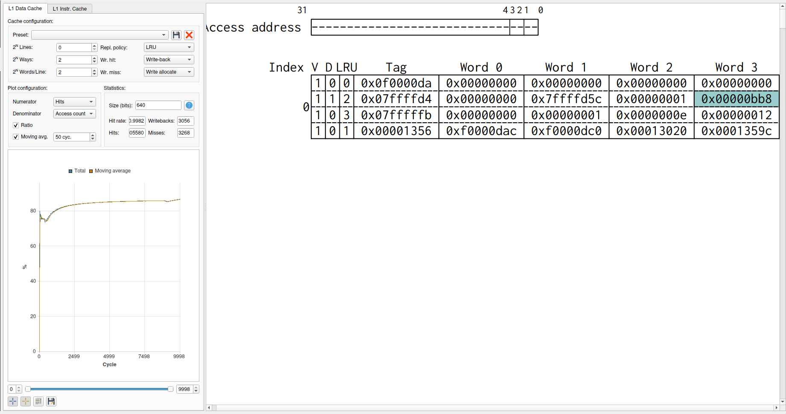

**HIT RATE:** 0.9982

## 16 LINES

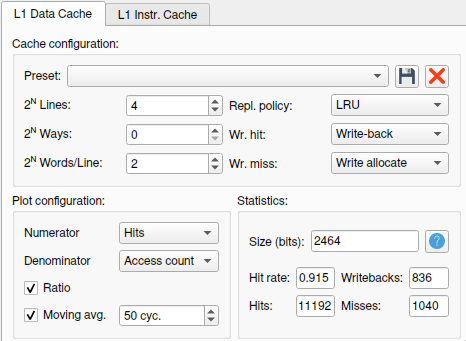

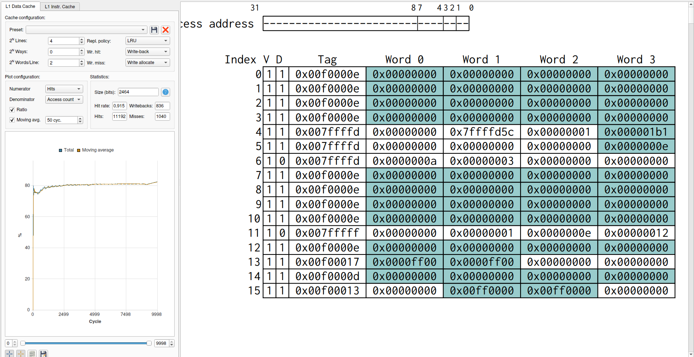

**HIT RATE:** 0.9663

## 4 LINES AND 4 WAYS

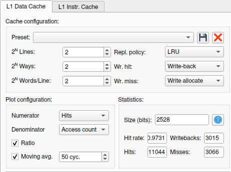

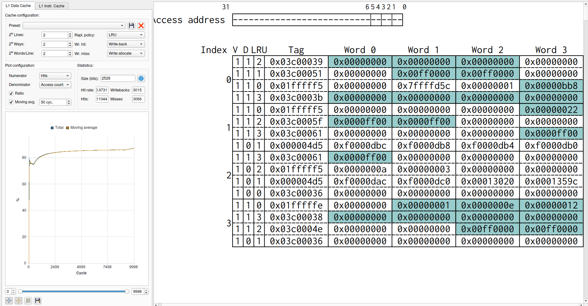

**HIT RATE:** 0.9731

## 16 WAYS

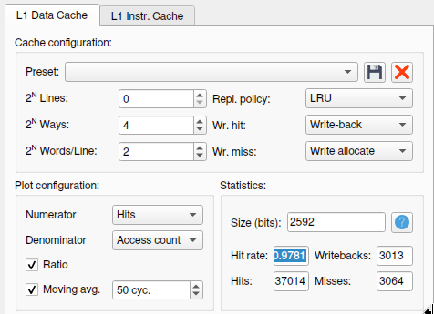

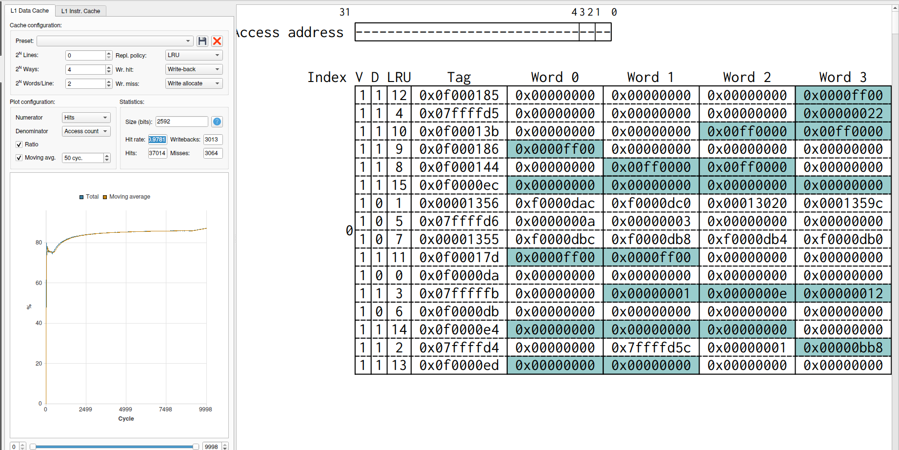

**HIT RATE:** 0.9781

## BEST HIT RATE

**0.9982**

# CONCLUSION
